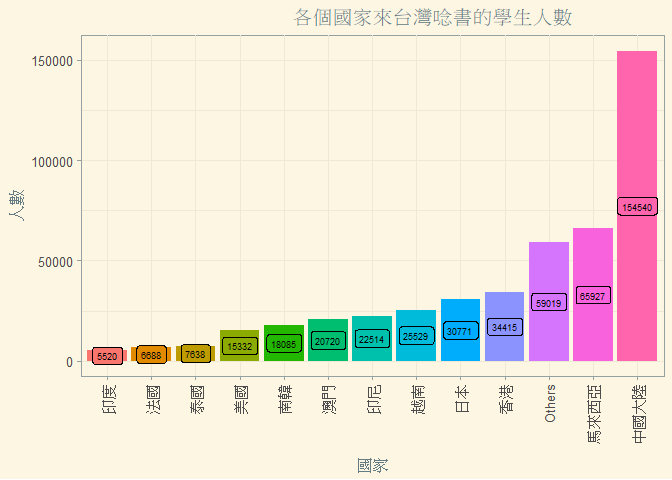
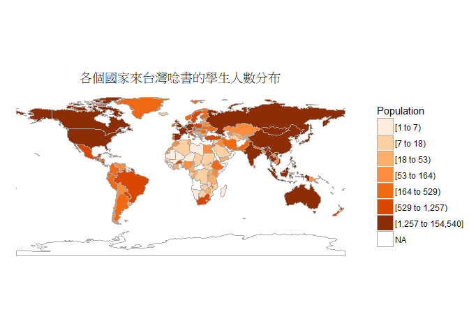
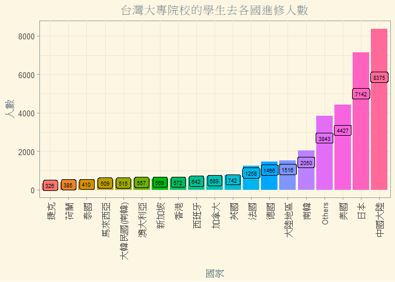
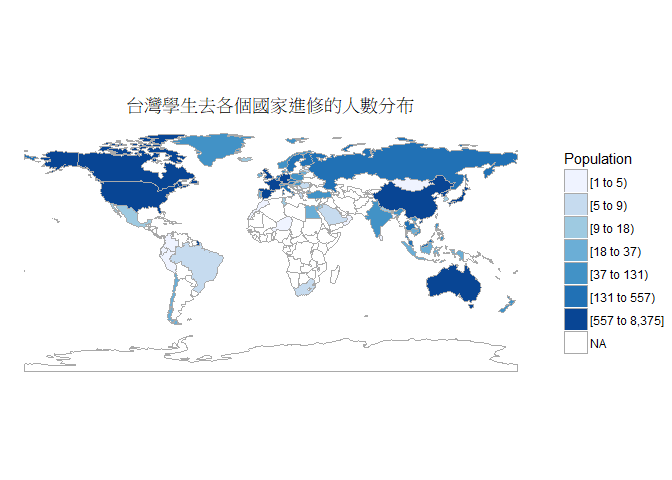
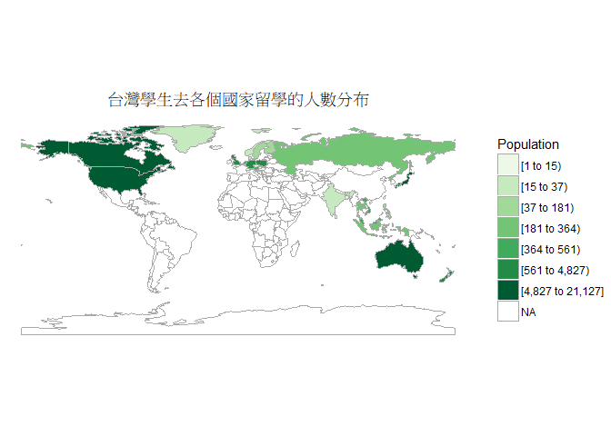
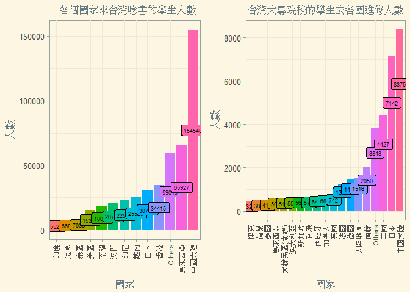
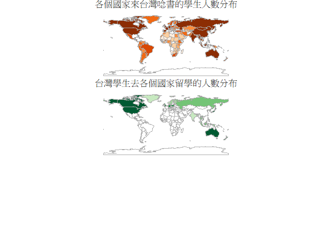

106-2 大數據分析方法 作業二
================
fdj612

作業完整說明[連結](https://docs.google.com/document/d/1aLGSsGXhgOVgwzSg9JdaNz2qGPQJSoupDAQownkGf_I/edit?usp=sharing)

學習再也不限定在自己出生的國家，台灣每年有許多學生選擇就讀國外的大專院校，同時也有人多國外的學生來台灣就讀，透過分析[大專校院境外學生人數統計](https://data.gov.tw/dataset/6289)、[大專校院本國學生出國進修交流數](https://data.gov.tw/dataset/24730)、[世界各主要國家之我國留學生人數統計表](https://ws.moe.edu.tw/Download.ashx?u=C099358C81D4876CC7586B178A6BD6D5062C39FB76BDE7EC7685C1A3C0846BCDD2B4F4C2FE907C3E7E96F97D24487065577A728C59D4D9A4ECDFF432EA5A114C8B01E4AFECC637696DE4DAECA03BB417&n=4E402A02CE6F0B6C1B3C7E89FDA1FAD0B5DDFA6F3DA74E2DA06AE927F09433CFBC07A1910C169A1845D8EB78BD7D60D7414F74617F2A6B71DC86D17C9DA3781394EF5794EEA7363C&icon=..csv)可以了解103年以後各大專院校國際交流的情形。請同學分析以下議題，並以視覺化的方式呈現分析結果，呈現103年以後大專院校國際交流的情形。

來台境外生分析
--------------

### 資料匯入與處理

``` r
library(jsonlite)
ToTWNSch103 <- fromJSON("https://quality.data.gov.tw/dq_download_json.php?nid=6289&md5_url=a6d1469f39fe41fb81dbfc373aef3331")
ToTWNSch104 <- fromJSON("https://quality.data.gov.tw/dq_download_json.php?nid=6289&md5_url=8baeae81cba74f35cf0bb1333d3d99f5")
ToTWNSch105 <- fromJSON("https://quality.data.gov.tw/dq_download_json.php?nid=6289&md5_url=1a485383cf9995da679c3798ab4fd681")
ToTWNSch106 <- fromJSON("https://quality.data.gov.tw/dq_download_json.php?nid=6289&md5_url=883e2ab4d5357f70bea9ac44a47d05cc")

CYToTWN103 <- fromJSON("https://quality.data.gov.tw/dq_download_json.php?nid=6289&md5_url=25f64d5125016dcd6aed42e50c972ed0")
CYToTWN104 <- fromJSON("https://quality.data.gov.tw/dq_download_json.php?nid=6289&md5_url=4d3e9b37b7b0fd3aa18a388cdbc77996")
CYToTWN105 <- fromJSON("https://quality.data.gov.tw/dq_download_json.php?nid=6289&md5_url=19bedf88cf46999da12513de755c33c6")
CYToTWN106 <- fromJSON("https://quality.data.gov.tw/dq_download_json.php?nid=6289&md5_url=50e3370f9f8794f2054c0c82a2ed8c91")

ToTWNSch103$`非學位生-大陸研修生` <- gsub("…", "NA", ToTWNSch103$`非學位生-大陸研修生`)
ToTWNSch104$`非學位生-大陸研修生` <- gsub("…", "NA", ToTWNSch104$`非學位生-大陸研修生`)

for(i in c(4:12)){
  ToTWNSch103[,i] <- as.numeric(ToTWNSch103[,i])
  ToTWNSch104[,i] <- as.numeric(ToTWNSch104[,i])
  ToTWNSch105[,i] <- as.numeric(ToTWNSch105[,i])
  ToTWNSch106[,i] <- as.numeric(ToTWNSch106[,i])
}

for(i in c(3:11)){
  CYToTWN103[,i] <- as.numeric(CYToTWN103[,i])
  CYToTWN104[,i] <- as.numeric(CYToTWN104[,i])
  CYToTWN105[,i] <- as.numeric(CYToTWN105[,i])
  CYToTWN106[,i] <- as.numeric(CYToTWN106[,i])
}
```

### 哪些國家來台灣唸書的學生最多呢？

``` r
library(dplyr)
CYToTWN103 <- CYToTWN103%>%
                          mutate(Total = rowSums(.[grep("學位生|境外專班", names(.))], na.rm = T))
CYToTWN104 <- CYToTWN104%>%
                          mutate(Total = rowSums(.[grep("學位生|境外專班", names(.))], na.rm = T))
CYToTWN105 <- CYToTWN105%>%
                          mutate(Total = rowSums(.[grep("學位生|境外專班", names(.))], na.rm = T))
CYToTWN106 <- CYToTWN106%>%
                          mutate(Total = rowSums(.[grep("學位生|境外專班", names(.))], na.rm = T))

CY103To106 <- merge(CYToTWN106%>%
                          select(國別, Total),
                         CYToTWN104%>%
                          select(國別, Total),
                         by = "國別", all = T)
CY103To106 <- merge(CY103To106,
                         CYToTWN105%>%
                          select(國別, Total),
                         by = "國別", all = T)
CY103To106 <- merge(CY103To106,
                         CYToTWN106%>%
                          select(國別, Total),
                         by = "國別", all = T)
names(CY103To106) <- c("國別", "Total103", "Total104", "Total105", "Total106")

CY103To106 <- CY103To106%>%
                      mutate(Total103To106 = rowSums(.[grep("Total", names(.))], na.rm = T))
```

-   下表為103~106年度來台留學生的國家來源與人數總計
    -   結果為人數最多的前十名國家
    -   其中，來自中國的留學生最多，共有15萬4千540位，甚至是第二名"馬來西亞"人數的2倍多
    -   從國家推測，來台留學人數的多寡可能與地理位置遠近有關

``` r
knitr::kable(CY103To106%>%
               arrange(desc(Total103To106))%>%
              select(國別, Total103To106)%>%
              head(10))
```

| 國別     |  Total103To106|
|:---------|--------------:|
| 中國大陸 |         154540|
| 馬來西亞 |          65927|
| 香港     |          34415|
| 日本     |          30771|
| 越南     |          25529|
| 印尼     |          22514|
| 澳門     |          20720|
| 南韓     |          18085|
| 美國     |          15332|
| 泰國     |           7638|

### 哪間大學的境外生最多呢？

``` r
library(dplyr)
ToTWNSch103 <- ToTWNSch103%>%
                          mutate(Total = rowSums(.[grep("學位生|境外專班", names(.))], na.rm = T))
ToTWNSch104 <- ToTWNSch104%>%
                          mutate(Total = rowSums(.[grep("學位生|境外專班", names(.))], na.rm = T))
ToTWNSch105 <- ToTWNSch105%>%
                          mutate(Total = rowSums(.[grep("學位生|境外專班", names(.))], na.rm = T))
ToTWNSch106 <- ToTWNSch106%>%
                          mutate(Total = rowSums(.[grep("學位生|境外專班", names(.))], na.rm = T))

Sch103To106 <- merge(ToTWNSch103%>%
                          select(學校名稱, Total),
                         ToTWNSch104%>%
                          select(學校名稱, Total),
                         by = "學校名稱", all = T)
Sch103To106 <- merge(Sch103To106,
                         ToTWNSch105%>%
                          select(學校名稱, Total),
                         by = "學校名稱", all = T)
Sch103To106 <- merge(Sch103To106,
                         ToTWNSch106%>%
                          select(學校名稱, Total),
                         by = "學校名稱", all = T)
names(Sch103To106) <- c("學校名稱", "Total103", "Total104", "Total105", "Total106")

Sch103To106 <- Sch103To106%>%
                      mutate(Total103To106 = rowSums(.[grep("Total", names(.))], na.rm = T))
Sch103To106 <- Sch103To106[complete.cases(Sch103To106), ]
```

-   下表為103~106年度來台留學生在台灣就讀的大專院校與人數總計
    -   結果為人數最多的前十名大專院校
    -   其中，就讀國立臺灣師範大學的留學生最多，共有2萬2千113位
    -   從學校來看，公立私立大學都有，沒有明顯偏向公立或私立

``` r
knitr::kable(Sch103To106%>%
               arrange(desc(Total103To106))%>%
              select(學校名稱, Total103To106)%>%
              head(10))
```

| 學校名稱         |  Total103To106|
|:-----------------|--------------:|
| 國立臺灣師範大學 |          22113|
| 國立臺灣大學     |          18199|
| 中國文化大學     |          16074|
| 銘傳大學         |          16057|
| 淡江大學         |          13887|
| 國立政治大學     |          11626|
| 國立成功大學     |          10982|
| 輔仁大學         |           9499|
| 逢甲大學         |           9474|
| 中原大學         |           7662|

### 各個國家來台灣唸書的學生人數條狀圖

``` r
library(dplyr)
standard <-mean(CY103To106$Total103To106)*2
CYPlot <- CY103To106%>%
                filter(Total103To106 > standard)%>%
                select(國別, Total103To106)
CYPlot <- rbind(CYPlot, CY103To106%>%
                          filter(Total103To106 <= standard)%>%
                          summarise(國別 = "Others", Total103To106 = sum(Total103To106)))
CYPlot$國別 <- factor(CYPlot$國別, 
                      levels = CYPlot$國別[order(CYPlot$Total103To106)])

library(ggplot2)
library(ggthemes)

Plot_CY <- CYPlot%>%
            ggplot(aes(x = 國別,
                       y = Total103To106, 
                       label = Total103To106,
                       fill = 國別))+
            geom_bar(stat = "identity")+ 
            labs(title = "各個國家來台灣唸書的學生人數",
                 x = "國家", y = "人數")+ 
            geom_label(position = position_stack(vjust = 0.5),
                       size = 2.3, colour = 'black')+ 
            guides(fill = F)+
            theme_solarized()+
            theme(plot.title = element_text(hjust = 0.7),
                  axis.text.x = element_text(angle = 90, hjust = 1, vjust = 0.5))
```

-   下圖為103~106年來台留學生的國家來源與人數總計
    -   由於國家數眾多，因此以各國家來台留學生總人數的2倍平均人數(3千303人)來做區隔
    -   小於此人數(3千303人)的國家歸類為Others國家，而大於此人數的國家則羅列出來(共12個)
    -   以人數多寡做國家的排序 (左)少-&gt;多(右)，長條圖中的數字代表此國家人數總計
    -   由長條圖可以明顯地看出各國來台人數的差距，其中以中國人數最為顯著

``` r
plot(Plot_CY)
```



### 各個國家來台灣唸書的學生人數面量圖

``` r
library(readr)
CYNames <- read_csv("CountriesComparisionTable.csv")
CYNames <- CYNames[!grepl("Unmatch",CYNames$English), ]

CY103To106 <- merge(CY103To106, CYNames,
                          by.x = "國別", by.y = "Taiwan", all.x = T)


library(dplyr)
CYToTWNDraw <- CY103To106%>%
                select(English, Total103To106)
names(CYToTWNDraw) <- c("region", "value")
CYToTWNDraw <- CYToTWNDraw[complete.cases(CYToTWNDraw), ]
CYToTWNDraw <- CYToTWNDraw[!duplicated(CYToTWNDraw$region), ]

library(choroplethr)

Draw_CYToTWN <-  country_choropleth(CYToTWNDraw)+ 
                 scale_fill_brewer(name="Population", palette=7, na.value="white")+
                 labs(title = "各個國家來台灣唸書的學生人數分布")+
                 theme(plot.title = element_text(hjust = 0.5))
```

-   下圖為103~106年來台留學生的國家分布面量圖
    -   顏色越深表示此國家來台留學生人數越多
    -   由圖可知，大多數來台留學生的國家分布在中國到馬來西亞一帶、美國與部分西歐國家

``` r
plot(Draw_CYToTWN)
```



台灣學生國際交流分析
--------------------

### 資料匯入與處理

``` r
library(readr)
ExchaFurther <- read.csv("Student_RPT_07.csv", encoding = "UTF-16")

library(dplyr)
ExchaFurther <- ExchaFurther%>%
                filter(學年度 >= 103)
```

### 台灣大專院校的學生最喜歡去哪些國家進修交流呢？

``` r
library(dplyr)
FurToCY <- ExchaFurther%>%
                 group_by(`對方學校.機構.國別.地區.`)%>%
                 summarise(Total = sum(小計))
```

-   下表為103~104年度台灣大專院校學生出國進修的目標國家與總計進修人數
    -   結果為人數最多的前十名目標國家
    -   其中，以前往中國的進修人數最多(8千375人)，再來是日本(7千142人)然後以此類推

``` r
knitr::kable(FurToCY%>%
               arrange(desc(Total))%>%
               select(`對方學校.機構.國別.地區.`, Total)%>%
               head(10))
```

| 對方學校.機構.國別.地區. |  Total|
|:-------------------------|------:|
| 中國大陸                 |   8375|
| 日本                     |   7142|
| 美國                     |   4427|
| 南韓                     |   2050|
| 大陸地區                 |   1516|
| 德國                     |   1466|
| 法國                     |   1258|
| 英國                     |    742|
| 加拿大                   |    689|
| 西班牙                   |    642|

### 哪間大學的出國交流學生數最多呢？

``` r
SchToFur <- ExchaFurther%>%
                 group_by(學校名稱)%>%
                 summarise(Total = sum(`小計`))%>%
                 arrange(desc(Total))
```

-   下表為103~104年度台灣大專院校學生出國進修的在台學校與總計進修人數
    -   結果為人數最多的前十名大專院校
    -   以台大的出國進修人數最多(2千224人)，再來是淡江(2千038人)然後以此類推
    -   其中，台大、淡江、政大、逢甲、成大等5所大專院校，在前面103~106學年度外國來台交換就讀的學校中也進入前十名，可能與學校特色有關

``` r
knitr::kable(head(SchToFur, 10))
```

| 學校名稱     |  Total|
|:-------------|------:|
| 國立臺灣大學 |   2224|
| 淡江大學     |   2038|
| 國立政治大學 |   1876|
| 逢甲大學     |   1346|
| 元智大學     |   1106|
| 國立臺北大學 |    956|
| 國立交通大學 |    951|
| 東海大學     |    931|
| 東吳大學     |    873|
| 國立成功大學 |    846|

### 台灣大專院校的學生最喜歡去哪些國家進修交流條狀圖

``` r
library(dplyr)
standard <-mean(FurToCY$Total)
FurtherPlot <- FurToCY%>%
                filter(Total > standard)%>%
                select(`對方學校.機構.國別.地區.`, Total)
FurtherPlot <- rbind(FurtherPlot, FurToCY%>%
                                  filter(Total <= standard)%>%
                                  summarise(`對方學校.機構.國別.地區.` = "Others", Total = sum(Total)))
FurtherPlot$`對方學校.機構.國別.地區.` <- factor(FurtherPlot$`對方學校.機構.國別.地區.`,
                                                 levels = FurtherPlot$`對方學校.機構.國別.地區.`[order(FurtherPlot$Total)])

library(ggplot2)
library(ggthemes)
Plot_Further <-  FurtherPlot%>%
                      ggplot(aes(x = `對方學校.機構.國別.地區.`,
                                 y = Total, 
                                 label = Total, label = Total,
                                 fill = `對方學校.機構.國別.地區.`))+
                      geom_bar(stat = "identity")+
                      labs(title = "台灣大專院校的學生去各國進修人數",
                           x = "國家", y = "人數")+ 
                      geom_label(position = position_stack(vjust = 0.7),
                                 size = 2.3,
                                 colour = 'black')+ 
                      guides(fill = F)+
                      theme_solarized()+
                      theme(plot.title = element_text(hjust = 0.5), 
                            axis.text.x = element_text(angle = 90, hjust = 1, vjust = 0.5))
```

-   下圖為為103~104年度台灣大專院校學生出國進修的目標國家與總計進修人數
    -   因為國家數量過多，因此以台灣學生出國進修人數的1倍平均人數(435人)來做區隔
    -   小於此人數(435人)的國家歸類為Others國家，而大於此人數的國家則羅列出來(共12個)
    -   以人數多寡做國家的排序 (左)少-&gt;多(右)，長條圖中的數字代表此國家人數總計
    -   由長條圖可以輕易地看前往進修交流人數最多的前三大國家是中國、日本、美國

``` r
plot(Plot_Further)
```



### 台灣大專院校的學生最喜歡去哪些國家進修交流面量圖

``` r
FurToCY <- merge(FurToCY, CYNames,
                          by.x = "對方學校.機構.國別.地區.", by.y = "Taiwan", all.x = T)
FurToCY <- FurToCY[complete.cases(FurToCY), ]
library(dplyr)
FurtherDraw <- FurToCY%>%
                select(English, Total)
names(FurtherDraw) <- c("region", "value")
FurtherDraw <- FurtherDraw[complete.cases(FurtherDraw), ]
FurtherDraw <- FurtherDraw[!duplicated(FurtherDraw$region), ]

library(choroplethr)

Draw_Further <- country_choropleth(FurtherDraw)+ 
                  scale_fill_brewer(name="Population", palette=1, na.value="white")+
                  labs(title = "台灣學生去各個國家進修的人數分布")+
                  theme(plot.title = element_text(hjust = 0.5))
```

-   下圖為103~104年台灣大專院校學生出國進修交換的國家人數分布面量圖
    -   顏色越深表示台灣學生前往進修人數越多
    -   由圖可知，大多數台灣學生選擇進修的國家分布在中國日本一帶、美國、與部分西歐國家

``` r
plot(Draw_Further)
```



台灣學生出國留學分析
--------------------

### 資料匯入與處理

``` r
library(readr)
CYAbroad105 <- read_csv("https://ws.moe.edu.tw/Download.ashx?u=C099358C81D4876CC7586B178A6BD6D5062C39FB76BDE7EC7685C1A3C0846BCDD2B4F4C2FE907C3E7E96F97D24487065577A728C59D4D9A4ECDFF432EA5A114C8B01E4AFECC637696DE4DAECA03BB417&n=4E402A02CE6F0B6C1B3C7E89FDA1FAD0B5DDFA6F3DA74E2DA06AE927F09433CFBC07A1910C169A1845D8EB78BD7D60D7414F74617F2A6B71DC86D17C9DA3781394EF5794EEA7363C&icon=..csv")
CYAbroad105 <- CYAbroad105[, c(1:3)]
```

### 台灣學生最喜歡去哪些國家留學呢？

-   下表為105年度台灣學生出國留學的國家與總計人數
    -   結果為人數最多的前十名大專院校
    -   選擇美國的人數最多(2萬1千127人)，再來是澳大利亞(1萬3千582人)然後以此類推

``` r
library(dplyr)
knitr::kable(
  CYAbroad105%>%
    arrange(desc(總人數))%>%
    select(國別, 總人數)%>%
    head(10))
```

| 國別     | 總人數 |
|:---------|:------:|
| 美國     |  21127 |
| 澳大利亞 |  13582 |
| 日本     |  8444  |
| 加拿大   |  4827  |
| 英國     |  3815  |
| 德國     |  1488  |
| 紐西蘭   |  1106  |
| 波蘭     |   561  |
| 馬來西亞 |   502  |
| 奧地利   |   419  |

### 台灣學生最喜歡去哪些國家留學面量圖

``` r
CYAbroad105 <- merge(CYAbroad105, CYNames,
                          by.x = "國別", by.y = "Taiwan", all.x = T)

library(dplyr)
AbroadDraw <- CYAbroad105%>%
                select(English, 總人數)
names(AbroadDraw) <- c("region", "value")

library(choroplethr)
Draw_Abroad <-  country_choropleth(AbroadDraw)+ 
                  scale_fill_brewer(name="Population", palette=5, na.value="white")+
                  labs(title = "台灣學生去各個國家留學的人數分布")+
                  theme(plot.title = element_text(hjust = 0.5))
```

-   下圖為105年台灣學生選擇出國留學的的國家人數分布面量圖
    -   顏色越深表示台灣學生前去留學人數越多
    -   由圖可知，大多數台灣學生選擇留學的國家分布在美國和澳大利亞

``` r
plot(Draw_Abroad)
```



綜合分析
--------

請問來台讀書與離台讀書的來源國與留學國趨勢是否相同(5分)？想來台灣唸書的境外生，他們的母國也有很多台籍生嗎？請圖文並茂說明你的觀察(10分)。

-   以下2個圖分別是來台讀書的來源國與人數和離台讀書的留學國與人數長條圖
    -   由圖中移動人數來看，交換人數最多的國家為中國，而來台趨勢較離台趨勢大
-   相較於同期的來台趨勢而言(來台趨勢中佔的比率)，和同期的離台趨勢而言(離台趨勢中佔的比率)
    -   其他來台相對趨勢&gt;離台相對趨勢的國家有：馬來西亞、香港、越南、印尼等國家
    -   其他來台相對趨勢&lt;離台相對趨勢的國家有：日本、美國、南韓、德國、法國等國家

``` r
library(ggplot2) 
library(grid)
library(gridExtra)
grid.arrange(Plot_CY+
               theme(plot.title = element_text(size = 12),
                 axis.text.x = element_text(size = 8)),
             Plot_Further+
               theme(plot.title = element_text(size = 12),
                     axis.text.x = element_text(size = 8)), 
             nrow = 1)
```



-   以下2張圖分別是來台讀書的國家與離台留學國家的面輛圖
    -   想來台灣念書的國家，其母國也很多台籍生的國家有：美國、澳大利亞、法國等國家
    -   想來台灣念書的國家，其母國沒有很多台籍生的國家有：蒙古、俄羅斯、越南、印度等國家

``` r
grid.arrange(Draw_CYToTWN+
               guides(fill = F), 
             Draw_Abroad+
               guides(fill = F), 
             nrow = 3)
```


